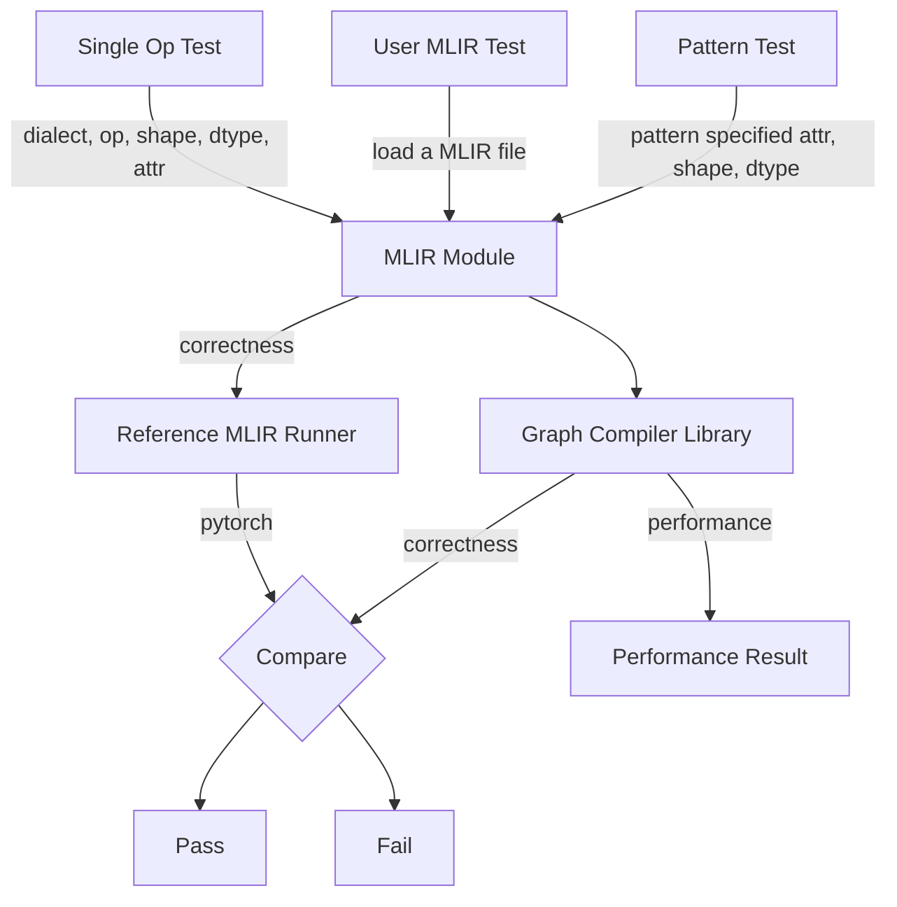

# BenchGC Overview

BenchGC is a testing tool for the Graph Compiler project, focusing on tuning performance and verifying the correctness of the Graph Compiler. The benchmark and validation work will be supported on both CPU and GPU . 

BenchGC will also be part of the CI test and checking the regular correctness check for each PR. 

### What can BenchGC provide?
* Working modes
  - Correctness
  - Performance
  - Tuning
* Validation scope
  - Single MLIR linalg op
  - Predefined pattern (such as MLP)
  - MLIR Module provided by user
* Data filling strategy
  - Benchdnn filling strategy (mainly for single op validation)
  - Common distribution filling
  - Load from pytorch dump
* Result comparison strategy
  - Benchdnn compare strategy (mainly for single op validation)
  - User defined threshold

### BenchGC workflow

### Acknowledgements
This work is inspired by the [benchdnn](https://github.com/oneapi-src/oneDNN/tree/main/tests/benchdnn) component from [oneDNN](https://github.com/oneapi-src/oneDNN/) project developed by Intel.
