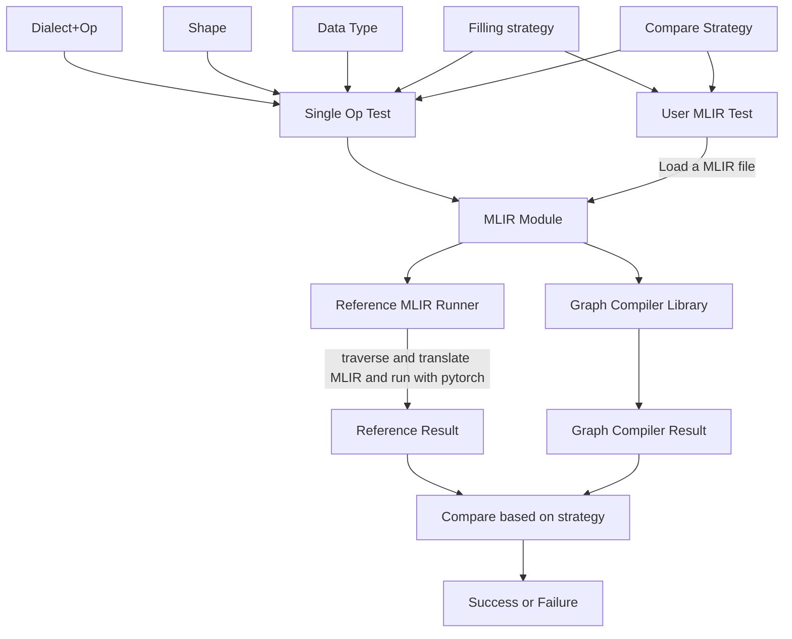

# BenchGC Overview

BenchGC is a testing tool for the Graph Compiler project, currently focusing on verifying the correctness of the Graph Compiler.

### What can BenchGC do?
* Single MLIR Op validation
* User-provided MLIR Module validation
* Data filling strategy
* Result comparison strategy

### BenchGC workflow

