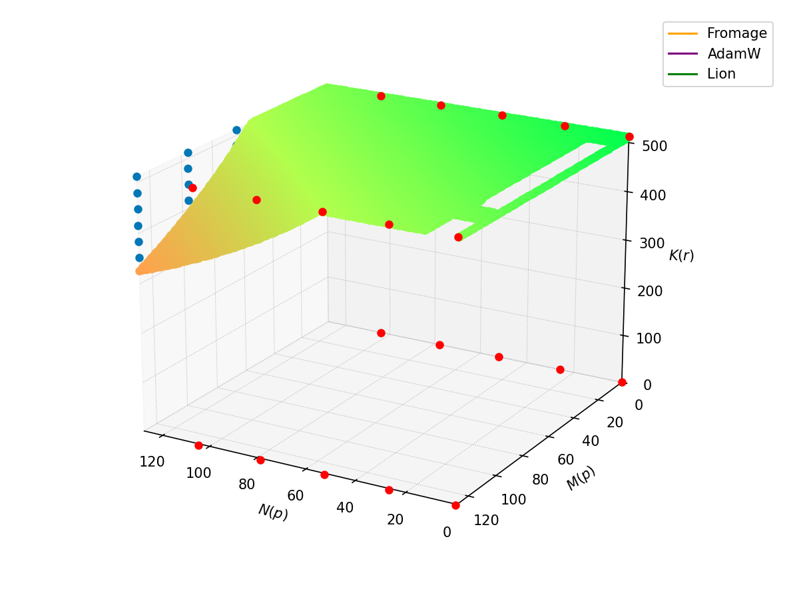
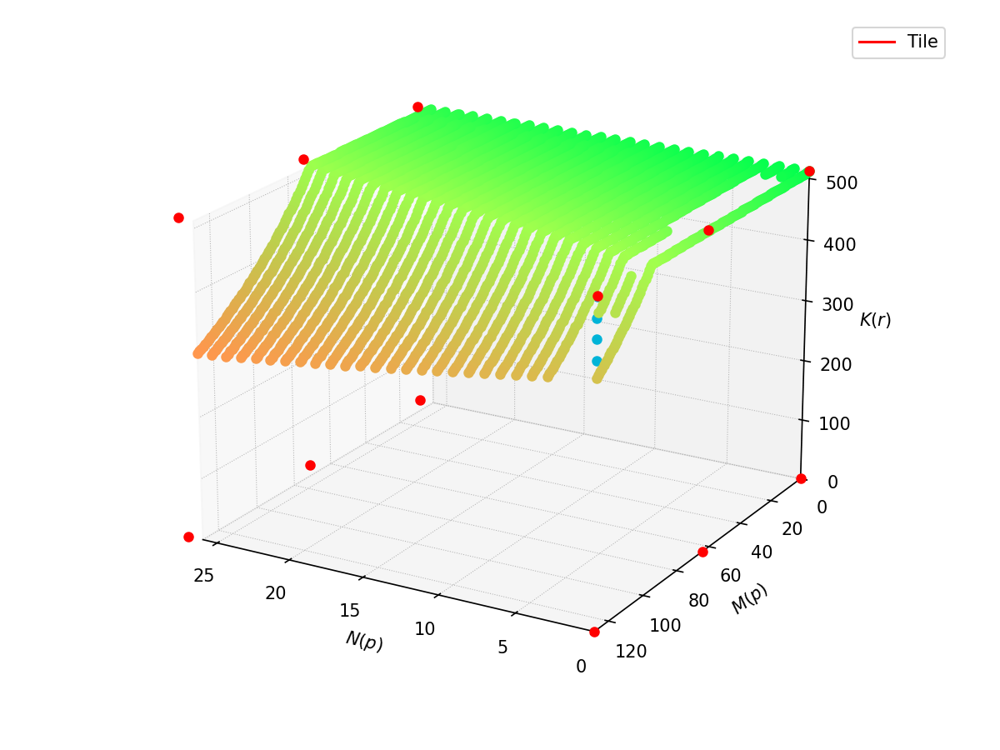
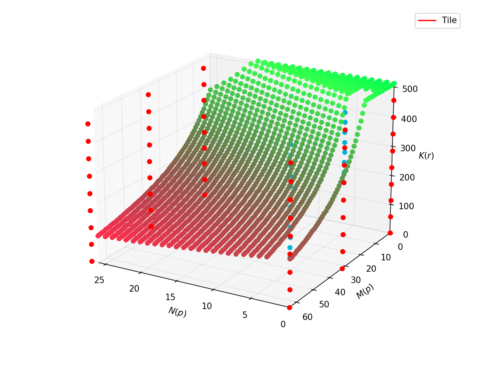

Tiling pass currently applies IR transformation immediately, this is possible design for analysis, that should decide which tile sizes are fine and most "effective" in terms of memory or preformance. Some approaches to tiling can conflict with each other (depending on hardware). 

I think there should be some schema (or layout) that can be modified from analysis to analysis. Such approach allow to have some consensus with several types of analysis and avoid unresolvable configurations. 

We will start analysis with the example of matmul:

```
[128 x 512] ifm         [512 x 128] weight
    \                       /
              matmul
                |
          [128 x 128] ofm
```
Sometimes I will use following abbreveations: 
 - **ifm** stands for input feature map, 
 - **ofm** - output feature map. 

Most interesting hardware parameters for tiling are:
  1. memory (or maybe memory hierarchy)
  2. parallelisation

To compare differnet tiling layouts I will try to calculate amount of ticks for execution and use several assumptions about HW, attempting to formulate minimal model that needed to make a decision on layout. 

To make this prediction more applicable to specific HW we will need to understand how long takes load/store/execution compared to each other and depending on amount of data they are processing. 

In general there are 2 approaches to tiling of ops:
   1. Split input -> write over outputs 
   2. Split output -> calculate how much of input we need for each tile. 

Both approaches can be applied, but I want to propagate layout throught several operations, which can be done in more memory-saving way when we start from ofm. So mainly I will focus on 2nd option.

I will start description from memory, as this constraint is more strict.

## Memory 

In this chapter I will assume several things about HW:
   1. We have one execution unit and one buffer or buffer hierarachy. 
   2. Execution unit can handle only single execution command. (we can't have 2 simultaneous executions)
      ```
      0  load_ifm0 load_w0
      1  execute (ofm0)       execute (ofm0)      # Not possible - structural hazard           
      ```
   3. Execution stage blocks from any read/modification all used parts of buffer. (we can't write into place, which used during execution)
      e.g.
      in buffer we wahe: 
      ```
         +------+-------------+------+------+
         | ifm0 |     w0      | ofm0 | ofm1 |
         +------+-------------+------+------+
      ```
      ```
      0  load_ifm0 load_w0
      1  execute (ofm0)      # cannot access on this tick to ifm0, w0 and ofm0           
      ```
   4. Schema with ticks assume, that all ops in a row triggered simultneously.
      e.g.
      ```
      0  load_ifm load_w
      1  execute              store_ofm
      ```
      means that we are loading ifm and w into buffer simultaneously and than 
      execution of op with simultaneous storing of some ofm.

Origianl layer without tiling requires `128*128 + 128*512*2 = 147'456` of memory. To simplify calculations I will use `dtype = 1`, so all sizes are simple multiplication of shapes. 
Black-box execution of this layer can be described in this form: 
```
0 | t   load_ifm load_w
1 *     execute
2       store_ofm
```

Each row is a tick, amount of them increases from first to last.

We need some estimation for load/store time depending on size, and execution depending on size. 
Dependency of execution time from total processing data size should be almost linear. (as in general we are changing loop boundaries)
Dependency of load/store operation time from data size can be non-trivial - it can be constant or stepped, or linear. 

We won't focus on this and will just use them as some same-sized in time units. 

Let's estimate what changing in case of 4 ofm tiles. `2` tiles along h in input, `2` tiles along w in weights.

```
input                            weight 
               512                        64          64
    +-----------------------+        +-----------|-----------+
 64 |          1            |        |           |           |
    |                       |        |           |           |
    -------------------------    512 |    3      |    4      |
 64 |          2            |        |           |           |
    |                       |        |           |           |
    +-----------------------+        +-----------|-----------+

output
       64         64        
    +-----------|-----------+
 64 |   13      |    14     |
    |           |           |
    -------------------------
 64 |   23      |    24     |
    |           |           |
    +-----------|-----------+
```
so ifm and weight sizes are `[64 x 512]` and `[512 x 64]`.

Consider execution workflow without memory restriction:
```
0 |      load_ifm0 load_w0         
1 *      execution_t0       load_ifm1 load_w0
2        store_ofm0         execution_t1       load_ifm0 load_w1
3                           store_ofm1         execution_t2       load_ifm1 load_w1
4                                              store_ofm2         execution_t3
5                                                                 store_ofm3
```
in each row all ops can be triggered simultaneously, but expected that stage ends when slowest ends
We need to decide which of these options ares better. 

Let's take a look what changes in the case of tiling along "reduction" axis. We will need extra space for summation.
If we tile along reduction axis:

```
input                            weight 
       256        256                     64          64
    +-----------|-----------+        +-----------|-----------+
 64 |    1      |    2      |    256 |    5      |    6      |
    |           |           |        |           |           |
    -------------------------        -------------------------
 64 |    3      |    4      |    256 |    7      |    8      |
    |           |           |        |           |           |
    +-----------|-----------+        +-----------|-----------+

output
       64         64        
    +-----------|-----------+
 64 |    01     |    23     |
    |           |           |
    -------------------------
 64 |    45     |    67     |
    |           |           |
    +-----------|-----------+
```
```

                     1 * 5                                                2 * 7                                             1 * 6                                                 2 * 8
[64 (high) x 256(left)] [256(high) x 64 (left)]      [64(high) x 256(right)] [256(low) x 64(left)]     [64 (high) x 256(left)] [256(high) x 64 (right)]      [64(high) x 256(right)] [256(low) x 64(right)]
            [64 (high) x 64 (left)] part                         [64 (high) x 64 (left)] part                      [64 (high) x 64 (right)] part                         [64 (high) x 64 (right)] part
                                      [64 (high) x 64 (left)]                                                                                  [64 (high) x 64 (right)] 

                    3 * 5                                                4 * 7                                             3 * 6                                                 4 * 8
[64 (low) x 256(left)] [256(high) x 64 (left)]       [64(low) x 256(right)] [256(low) x 64(left)]      [64 (low) x 256(left)] [256(high) x 64 (right)]       [64(low) x 256(right)] [256(low) x 64(right)]
              [64 (low) x 64 (left)] part                        [64 (low) x 64 (left)] part                       [64 (low) x 64 (right)] part                          [64 (low) x 64 (right)] part
                                      [64 (low) x 64 (left)]                                                                                    [64 (low) x 64 (right)] 
```
```
 0  |     load_ifm1 load_w5         
 1  *     execution_t15       load_ifm2 load_w7 
 2                            execution_t27      load_w6
 3        sum(ofm0 ofm1)                         execution_t16      load_w8
 4        store_ofm01                                               execution_t28       load_ifm3
 5                                                sum(ofm2 ofm3)                        execution_t35      load_ifm4
 6                                                store_ofm23                                              execution_t47    
 7                                                                                      sum(ofm4 ofm5)                      execution_t36
 8                                                                                      store_ofm45                                          execution_t48
 9                                                                                                                          sum(ofm6 ofm7)
10                                                                                                                          store_ofm610
```


These 3 configurations should be chosen on the basis of HW model. Number of possibiliteies will be strictly limited with amount of memory. 

It is trivial example that reduces memory usage. Without tiling memory required `128*512*2 + 128*128 = 147'456`. And in buffer it uses trivial memory layot:
```
 +------+-------------+------+
 | ifm0 |     w0      | ofm0 |
 +------+-------------+------+
```
Memory usage can be reduced with extra load operations. In extreme case this tiling can be used with memory for single tile and space for partial sum: `64*256*2 (ifm + w) + 64*64 + 64*64 + 64*64 = 45'056`. 
```
 +------+-------------+--------+--------+------+
 | ifm0 |     w0      | ofm0_p | ofm1_p | ofm0 |
 +------+-------------+--------+--------+------+
``` 

Of cause such estimation ignores possible fragmatation and depends on ops possibility to execute inplace. 

We will consider several strategies to decrease amount of produced ticks in the following examples.

### Memory with hierarchy

When we have memory hierarchy it's possible to apply tiling stage by stage from biggest buffer to smallest or to tile in one stage to the smallest buffer. (How to decide - depends on memory and what it does). In the case of multistage approach we will have several estimations that will be depend on each other. This can be very difficult to estimate effectively. 

Let's take a look for both appraoches with 3 levels of memory hierarchy: 

```
    [ 10'000 ]      1st level
        | 
   [  50'000  ]     2nd level
        |
 [    100'000    ]  3rd level

```

Consider these 2 ways of tiling for these memory hierarchy for already used matmul layer. 

#### Multistage approach

Tile for `3rd level` so size of tiled op should fit into `100'000`. For this will be enough Output tiling:

```
original [128 x 128] -> just divide by 2 -> tile [64 x 64]                              
```

```
input                            weight 
               512                        64          64
    +-----------------------+        +-----------|-----------+
 64 |          1            |        |           |           |
    |                       |        |           |           |
    -------------------------    512 |    3      |    4      |
 64 |          2            |        |           |           |
    |                       |        |           |           |
    +-----------------------+        +-----------|-----------+

output
       64         64        
    +-----------|-----------+
 64 |   13      |    14     |
    |           |           |
    -------------------------
 64 |   23      |    24     |
    |           |           |
    +-----------|-----------+
```

So required size is: `64*512*2 + 64*64 = 69'632`. 

```
0 |      3: load_ifm1 load_w3         
1 *      execution_t0          
2        store_ofm13           3: load_ifm2 
3                              execution_t1 
3                              store_ofm23   3: load_ifm1 load_w4
4                                            execution_t2          
5                                            store_ofm14           3: load_ifm2
6                                                                  execution_t3
7                                                                  store_ofm24
```

It takes `8` ticks. In this case layout in buffer is: 
```
 +------+-------------+------+
 | ifm0 |     w0      | ofm0 |
 +------+-------------+------+
```

Let's try to reduce amount of ticks.

```
  x*512*2 (ifm0 + ifm1) + 128*512 (w0) + x*128*2 (ofm0 + ofm1) = 100'000 (buffer size)
```
`x = 26`-> requires `5` tiles -> more regular: `x = 26`, tiles are `26 26 26 26 24`.
```
 +------+------+-------------+------+------+
 | ifm0 | ifm1 |     w0      | ofm0 | ofm1 |
 +------+------+-------------+------+------+
```

```
0 |      3: load_ifm0 load_w0         
1 *      execution_t0          3: load_ifm1 
2        store_ofm0            execution_t1   3: load_ifm0
3                              store_ofm1     execution_t2   3: load_ifm1
4                                             store_ofm0     execution_t3  3: load_ifm1
5                                                            store_ofm1    execution_t4
6                                                                          store_ofm0
```
This configuration requires `7` ticks, which is a little better. 

```
input                            weight 
               512                              128
    +-----------------------+        +----------------------+
 26 |          1            |        |                      |
    -------------------------        |                      |
 26 |          2            |    512 |          6           |
    -------------------------        |                      |
 26 |          3            |        |                      |
    -------------------------        +----------------------+
 26 |          4            |
    -------------------------
 24 |          5            |
    +-----------------------+

output
           128        
    +---------------+
 26 |       16      |
    -----------------
 26 |       26      |
    -----------------
 26 |       36      |
    -----------------
 26 |       46      |
    -----------------
 24 |       56      |
    +---------------+
```
As it's best, let's use this tiling.

Visualisation of tiling in iteration space with initial buffer size constraint (naive buffer layout). Most difficult question is finding appropriate tile configurations with non-linear constraints issued by memory size and chosen layout. 



Now we should calculate tile sizes for single tile for `2nd level` buffer: 

```
[26 x 512] ifm         [512 x 128] weight
    \                       /
              matmul
                |
          [26 x 128] ofm
``` 

```
input                            weight 
               512                            128
    +-----------------------+        +--------------------+
 26 |                       |        |                    |
    +-----------------------+        |                    |
                                     |                    |
                                 512 |                    |
                                     |                    |
                                     |                    |
                                     |                    |
                                     +--------------------+

output
                128        
    +----------------------+
 26 |                      |
    +----------------------+
```

As weigth is beiggest tensor used for operaion processing, let's try to split it. 

Straightforward layout in buffer: 
```
 +------+-------------+------+
 | ifm0 |     w0      | ofm0 |
 +------+-------------+------+
```
Such layout produce smallest amount of tiles.
```
  26*512 (ifm0) + x*512 (w0) + 26*x (ofm) = 50'000 (buffer size)
```
`x = 68` -> 2 tiles required -> `x = 64`. 

Corresponding execution:
```
0 |      2: load_ifm0 load_w0         
1 *      execution_t0          
2        store_ofm0           2: load_w1
3                             execution_t1
4                             store_ofm1  
```
So `5` ticks. 

Let's estimate how much will take execution with more tiles, but also more units utilization. 
```
 +------+-------------+-------------+------+------+
 | ifm0 |     w0      |     w1      | ofm0 | ofm1 |
 +------+-------------+-------------+------+------+
```
```
  26*512 (ifm0) + (x*512 + 26*x)*2 (2 ofm + 2 w) = 50'000 (buffer size)
```
`x = 34` -> 4 tiles required -> `x = 32`. 

Corresponding execution:
```
0   2: load_ifm0 load_w0         
1   execution_t0          2: load_w1 
2   store_ofm0            execution_t1  2: load_w2
3                         store_ofm1    execution_t2   2: load_w3
4                                       store_ofm0     execution_t2
5                                                      store_ofm1                             
```
`6` ticks which is worth than naive approach. 

Let's also check tiling along reduction axis. In this case extra sum op will be required so buffer layout:
```
 +------+-------------+--------+--------+------+
 | ifm0 |     w0      | ofm0_p | ofm1_p | ofm0 |
 +------+-------------+--------+--------+------+
```
```
  26*x (ifm0) + x*128 (w) + 26*128*3 (3 ofm) = 50'000 (buffer size)
```
`x = 259` -> 2 tiles required -> `x = 256`. 

Corresponding execution:
```
0   2: load_ifm0 load_w0         
1   execution_t0 (ofm0_p)
2                          2: load_w1
3                          execution_t0 (ofm1_p)
4                          sum(ofm0_p, ofm1_p)
5                          store_ofm0
```
As you see tiling along reduction axis is not very effective as produces extra stages, which can slow down execution.

Tiling visualisation for result of this stage: 



Let's combine solutions for 1st level and 2nd:

```
0        3: load_ifm0 load_w0         
1           2: load_ifm0 load_w0         
2           execution_t0          
3           store_ofm0           2: load_w1
4                                execution_t1
5                                store_ofm1        3: load_ifm1 
6-10     store_ofm0                                execution_t1   3: load_ifm0
11-15                                              store_ofm1     execution_t2   3: load_ifm1
16-20                                                             store_ofm0     execution_t3  3: load_ifm1
21-25                                                                            store_ofm1    execution_t4
26                                                                                             store_ofm0
```

Finally let's try to add tiling for `1st layer`:

```
input                            weight 
                512                      64
    +-----------------------+        +----------+
 26 |                       |        |          |
    +-----------------------+        |          |
                                     |          |
                                 512 |          |
                                     |          |
                                     |          |
                                     |          |
                                     +----------+
output
         64   
    +-----------+
 26 |           |
    +-----------+
```

At first let's try to avoid tiling along reduction axis. 
```
  x*512 + y*512 + x*y = 10'000
```
As `x*y` is relatively small, we can understand, that it will work if `x + y < 10'000/512 = 19`, so in general as we are interested in integer solutions,
let's try to have `5` tles for weight - `13 13 13 13 12`. So for `x + 13 < 19`  -> `x < 6`, so `5` tiles on input `6 5 5 5 5`. 
So output amount of tiles in this case is `5*5 = 25`. 

`5` tiles in w, and `5` tiles in input. 

Let's try to check some close solutions to reduce ofm amount of tiles.
`6` tiles in w - `11 11 11 11 11 9`, `x < 19 - 11 = 8 `, so `4` tiles for input -> `7 7 7 5`, and corresponding ofm tiles amount `24`.

`3` tiles for input -> `9 9 8`, so `3*512 + y*512 + 3*y = 10'000` -> `y = 10` -> `7` tiles in w: `10 10 10 10 10 10 4` ( maybe better is `10 9 9 9 9 9 9`), so ofm tiles amout is `7*3 = 21`.

`2` tiles for input -> `13 13`, so `13*512 + y*512 + 13*y = 10'000` -> `y = 6` -> `10` tiles in w: `7 7 7 7 7 7 7 7 4 4`, so ofm tiles amout is `10*2 = 20`.
```
0   1: load_ifm0 load_w0
1   execution_t0 
2   store_ofm0            1: load_w1
3                         execution_t1
4                         store_ofm0    1: load_w2
5                                       execution_t2
...
```
`n_ticks = num_tiles * 2 + 1 ` -> for `20` ofm tiles we need `41` ticks.

```
 +------+-------------+--------+--------+------+
 | ifm0 |     w0      | ofm0_p | ofm1_p | ofm0 |
 +------+-------------+--------+--------+------+
```

Let's check what will happen with tiling along reduction axis:
```
  26*x (ifm0) + x*64 (w) + 26*64*3 (3 ofm) = 10'000 (buffer size)
```
`x = 55` -> 10 tiles required -> `x = 52`. 

Corresponding execution:
```
0   2: load_ifm0 load_w0         
1   execution_t0 (ofm0_p)
2                          2: load_ifm1 load_w1
3                          execution_t1 (ofm1_p)
4                          ofm0 = sum(ofm0_p, ofm1_p)   2: load_ifm2 load_w2
5                                                       execution_t2 (ofm0_p)
6                                                       ofm1_p = sum(ofm0_p, ofm0)    2: load_ifm3 load_w3
7                                                                                     execution_t3 (ofm0_p)
8                                                                                     ofm0 = sum(ofm0_p, ofm1_p)  2: load_ifm4 load_w4
9                                                                                                                 execution_t4 (ofm0_p)   
10                                                                                                                ofm1_p = sum(ofm0_p, ofm0)
11                                                                                                                store_ofm1_p   
...
```

`n_ticks = (num_tiles - 1)*2 + 1 + 3 ` -> to process required `22` ticks. This result is much better than previous one.

```
 +------+-------------+------+-------------+--------+--------+------+--------+
 | ifm0 |     w0      | ifm1 |     w1      | ofm0_p | ofm1_p | ofm0 | ofm2_p |
 +------+-------------+------+-------------+--------+--------+------+--------+
```
Let's check what will happen with tiling along reduction axis:
```
  x*26*2 (ifm0) + x*64*2 (w) + 26*64*4 (3 ofm) = 10'000 (buffer size)
```
`x = 18` -> 29 tiles required -> `x = 18`. 

```
0   2: load_ifm0 load_w0   2: load_ifm1 load_w1      
1   execution_t0 (ofm0_p)  
2                          execution_t1 (ofm1_p)       2: load_ifm0 load_w0           
3                          ofm0 = sum(ofm0_p, ofm1_p)  execution_t2 (ofm2_p)          2: load_ifm1 load_w1
4                                                      ofm1_p = sum(ofm2_p, ofm0)     execution_t3 (ofm0_p)       2: load_ifm0 load_w1
5                                                                                     ofm0 = sum(ofm0_p, ofm1_p)  execution_t4 (ofm2_p)
6                                                                                                                 ofm1_p = sum(ofm2_p, ofm0)
7                                                                                                                 store_ofm1_p   
...
```
`n_ticks = num_tiles + 1 + 2 ` -> to process required `32` ticks.

This buffer layout can be used with tiling along second biggest dimnsion - weight w -> split `64` to `32 32`.
```
  x*26*2 (ifm0) + x*32*2 (w) + 26*32*4 (3 ofm) = 10'000 (buffer size)
```
`x = 57` -> 9 tiles required -> `x = 57`

So total amount of executions is `9*2 = 18`. So estimation for number of ticks is `21`. It's a little better than native approach.

So resulting tiling will have:

```
0        3: load_ifm0 load_w0         
1           2: load_ifm0 load_w0         
2-22        execution_t0          
23          store_ofm0           2: load_w1
24-44                            execution_t1
45                               store_ofm1        3: load_ifm1 
46-90    store_ofm0                                execution_t1   3: load_ifm0
91-135                                             store_ofm1     execution_t2   3: load_ifm1
136-180                                                           store_ofm0     execution_t3  3: load_ifm1
181-225                                                                          store_ofm1    execution_t4
226                                                                                            store_ofm0
```

So total tiled layer took about `226 ticks`. 

Corresponding visualisation for smallest buffer:



#### Tiling that uses smallest buffer 

TBD - Calculations here are not very accurate, need to check than, also ways of searching solution is not so simple. As in this case we have very big search space. 

Let's try to tile same sized matmul without several stages but just to fit into smallest buffer. Buffer size is `10'000`

```
input                            weight 
               512                             128
    +-----------------------+        +----------------------+
    |                       |        |                      |
    |                       |        |                      |
128 |                       |    512 |                      |
    |                       |        |                      |
    |                       |        |                      |
    +-----------------------+        +----------------------+

output
               128
    +----------------------+
    |                      |
    |                      |
128 |                      |
    |                      |
    |                      |
    +----------------------+
```

```
  x*512 (ifm0) + x*512 (w0) + x*x = 10'000 (buffer size)
```
from this equation: `x = 9`, which requires: `15` tiles for ifm and weights -> so tile sizes is `9` . This will produce `15*15 = 225` total amount of tiles.
```
0 |      1: load_ifm0 load_w0         
1 *      execution_t0
2        store_ofm0             1: load_ifm0 load_w0   
3                               execution_t1                
4                               store_ofm0             1: load_ifm0 load_w0 
5                                                      execution_t2
6                                                      store_ofm1_p           1: load_ifm0 load_w0                        
7                                                                             execution_t3 (ofm0)     
8                                                                             store_ofm0_p            1: load_ifm0 load_w0
9                                                                                                     execution_t4 (ofm1_p)
10                                                                                                    store_ofm0
```
`n_ticks = num_tiles * 2 + 1` -> `num_ticks = 450`, we will also need load to level 3, level 2, so it will be around `450 + 2 + 2 = 454`.

```
 +------+-------------+------+-------------+------+------+
 | ifm0 |     w0      | ifm1 |     w1      | ofm0 | ofm1 |
 +------+-------------+------+-------------+------+------+
```
```
  x*512*2 (ifm0) + x*512*2 (w0) + x*x*2 = 10'000 (buffer size)
```
`x = 4` -> 32 tiles in ifm and 32 tiles in weights -> total amount of tiles is `32 * 32 = 1024` -> so total amount of ticks is about `1024 + 2 + 2 = 1028` 


```
 +------+-------------+------+-------------+--------+--------+------+--------+
 | ifm0 |     w0      | ifm1 |     w1      | ofm0_p | ofm1_p | ofm0 | ofm2_p |
 +------+-------------+------+-------------+--------+--------+------+--------+
```

```
  32*y*2 (ifm0) + 32*y*2 (w0) + 32*32*4 = 10'000 (buffer size)
```
`y = 46` -> 12 tiles along reduction axis -> `y = 43`

```
0   2: load_ifm0 load_w0   2: load_ifm1 load_w1      
1   execution_t0 (ofm0_p)  
2                          execution_t1 (ofm1_p)       2: load_ifm0 load_w0           
3                          ofm0 = sum(ofm0_p, ofm1_p)  execution_t2 (ofm2_p)          2: load_ifm1 load_w1
4                                                      ofm1_p = sum(ofm2_p, ofm0)     execution_t3 (ofm0_p)       2: load_ifm0 load_w1
5                                                                                     ofm0 = sum(ofm0_p, ofm1_p)  execution_t4 (ofm2_p)
6                                                                                                                 ofm1_p = sum(ofm2_p, ofm0)
7                                                                                                                 store_ofm1_p   
...
```
In this configuration 4 tiles along input h, 12 tiles along reduction axis, 4 tiles along weight w -> total amount `4 * 4 * 12 = 192` tiles total.
number of ticks will be about `192 + 2 + 2 = 196`

## Threads/Cores

To utilize threads effectively we will need an amount of them and mark memory as shared/private for specific core. 

To estimate required amount of threads, we should use "diagonal" direction for axises that have parallel "iterator type", for reduction axis parallelisation should be used reduction tree logic, which much less effective than parallelisation along parallel axis. Also it can be used if the shared memory amount is enough. 

Let's take a look how our estimations will work in the case of several avialable execution units (let's assume 4) and 3 lavels of memory:

```
    [ 10'000 ]      1st level (local)
        | 
   [  50'000  ]     2nd level (shared)
        |
 [    100'000    ]  3rd level (shared)
```

We will tile this kind of matmul:
```
[128 x 512] ifm         [512 x 128] weight
    \                       /
              matmul
                |
          [128 x 128] ofm
```
Same as previously considered example.
 
For tiling of highest shared layer we can try to ise naive buffer layout:
```
 +------+-------------+------+------+-------------+------+------+-------------+------+------+-------------+------+
 | ifm0 |     w0      | ofm0 | ifm1 |     w1      | ofm1 | ifm2 |     w2      | ofm2 | ifm3 |     w3      | ofm3 |
 +------+-------------+------+------+-------------+------+------+-------------+------+------+-------------+------+
```
```
   x*y*4 (4 ifms) + y*z*4 (4 w) + x*z*4 (4 ofm) = 50'000 
                     |
             x*y + y*z + x*z = 12'500                 
```
At first let's try to avoid tiling on reduction:
```
 x*512 + 512*z + x*z = 12'500                 
```
```
 x*512 + 512*x + x*x = 12'500                 
```
`x = 12` -> required 11 tiles on each parallel, so `x = 12`.
So total anount of tiles: `11 * 11 = 121` tile total. 
So execution pipeline is: 
```
0 |      1: load_ifm0 load_w0    1: load_ifm1 load_w1   1: load_ifm2 load_w2  1: load_ifm3 load_w3      
1 *      execution_t0            execution_t1           execution_t2          execution_t3         
2        store_ofm0              store_ofm1             store_ofm2            store_ofm2             1: load_ifm0 load_w0       1: load_ifm3 load_w3  
3                                                                                                    execution_t4           ... execution_t7           
4                                                                                                    store_ofm0                 store_ofm3          
 ...
```
`num_ticks = (num_tiles/4) * 2 + 1` -> `num_ticks = 62`
With 1 execution unit for 2nd level we had `27` ticks, so we should try to reduce amount of ticks. Let's try to share weight:
```
 x*512*4 + 512*64 + x*64*4 = 50'000                 
```
`x = 7` -> 19 tiles in input. Total amount of tiles is `19 * 2 = 38`.

```
0 |      1: load_ifm0 load_w0       1: load_ifm3      
1 *      execution_t0          ...  execution_t3         
2        store_ofm0                 store_ofm2             1: load_ifm0         1: load_ifm3  
3                                                          execution_t4    ...  execution_t7           
4                                                          store_ofm0           store_ofm3          
 ...
```
Total pipeline layout is the same, so at first we load all 19 input tiles and w0 (first tile of weight), than we load same 19 input tiles with second weight tile (w1). 1 tick will be lost to load new weights:
`num_ticks = (num_tiles/4) * 2 + 1 + 1` -> `num_ticks = 21`
Let's try to parallelise loads with execution:
```
0 |      1: load_ifm0 load_w0 1: load_ifm1      
1 *      execution_t0         execution_t1      1: load_ifm2    1: load_ifm3     
2        store_ofm0           store_ofm1        execution_t2    execution_t3                
3                                               store_ofm2      store_ofm3               
4                                                      
 ...
```
`num_ticks = (num_tiles/2) * 1 + 2` -> `num_ticks = 21`

To have similar case with 3 tiles we need following layout: 
```
 x*512*6 + 512*64 + x*64*6 = 50'000                 
```
`x = 4` -> 32 tiles. Total amount of tiles: `32 * 2 = 64`.
In this case:
`num_ticks = (num_tiles/3) * 1 + 2` -> `num_ticks = 24`. 

Let's try to estimate amount of ticks if we have split on reduction:
```
 64*x*2 + x*128*2 + 64*128*3 = 50'000                 
```
`x = 66` -> 8 tiles required (along reduction)-> `x = 64`

```

0   1: load_ifm0 load_w0         1: load_ifm1 load_w1     
1   execution_t0                 execution_t1         
2   ofm0 = sum(ofm0_p, ofm1_p)                         1: load_ifm0 load_w0         1: load_ifm1 load_w1
3   store_ofm0                                         execution_t2                 execution_t3
4                                                      ofm0 = sum(ofm0_p, ofm1_p)                            1: load_ifm0 load_w0         1: load_ifm1 load_w1 
5                                                      store_ofm0                                            execution_t4                 execution_t5           
6                                                                                                            ofm0 = sum(ofm0_p, ofm1_p)
7                                                                                                            store_ofm0                
 ...
```
```
 +------+-------------+------+-------------+--------+--------+------+
 | ifm0 |     w0      | ifm1 |     w1      | ofm0_p | ofm1_p | ofm0 |
 +------+-------------+------+-------------+--------+--------+------+
```
So total amount of tiles: `8 * 2 = 16`. 
`num_ticks = (num_tiles/2)*2 + 1 + 1 = 18 `

If we will try to also have 2 tiles along weight w. 
```
 64*x*2 + x*64*2 + 64*64*3 = 50'000                 
```
`x = 147` -> 4 tiles required along reduction -> `x = 128`,
Total amount of tiles is `4 * 2 * 2 = 16`, pipeline will be similar, so number of ticks will be same. 
